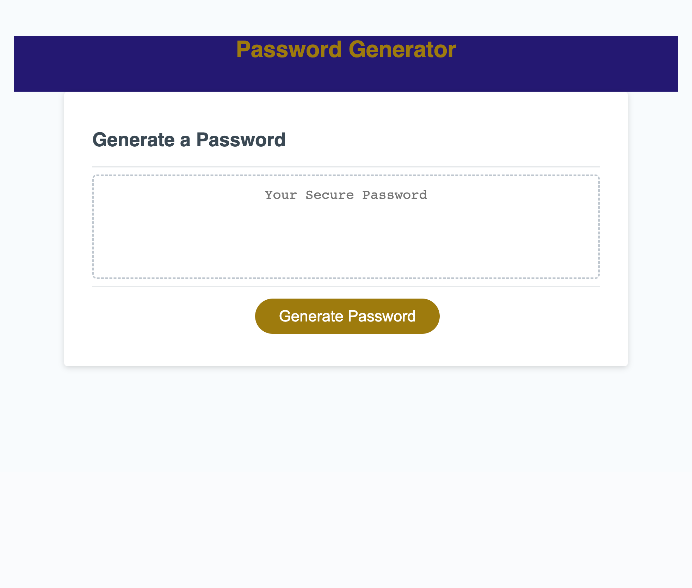

# Password-Generator

## Description
An application that generates a random password

## Usage
When clicking the "gnerate password" button the user is presented with a series of prompts as follows:
 1. Enter number of character for password.
 
    The user will be able to enter a number between 8 and 128 character for the length of their password. If the user's input is:
    * less than 8
    * greater than 128
    * not a number

    The user will be promted to enter a valid number.
2. Do you want numbers?
3. Do you want lowecase letters?
4. Do you want uppercase letters?
5. Do you want special characters?

The user must choose at least one condition for the password. If not, they will be alerted to choose at least one condition and they will be prompted to start over.

## Screenshot

